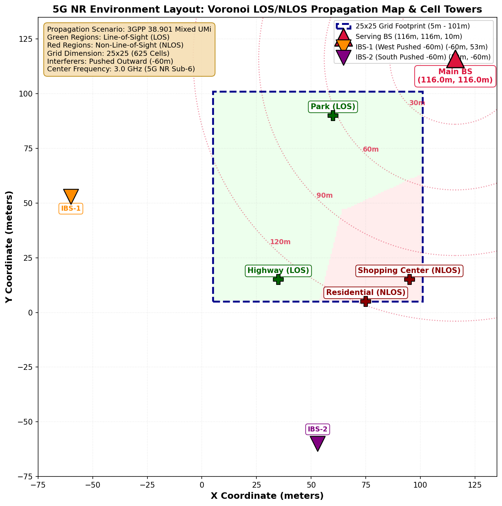
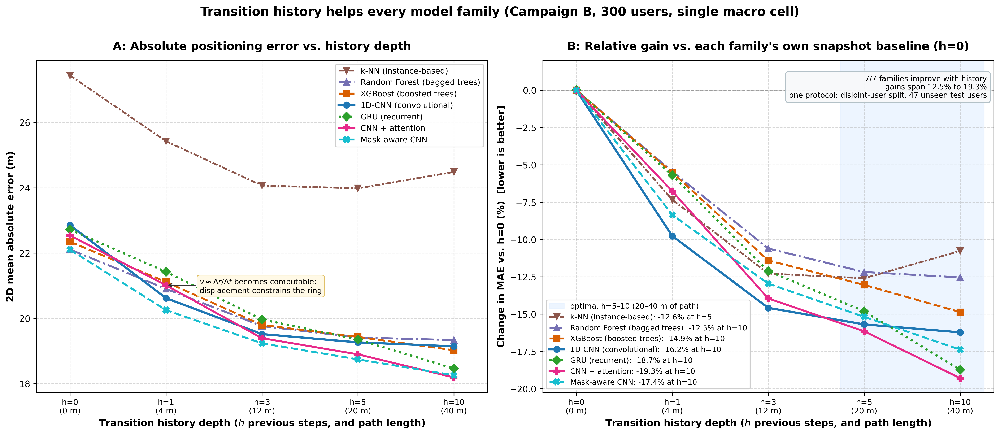
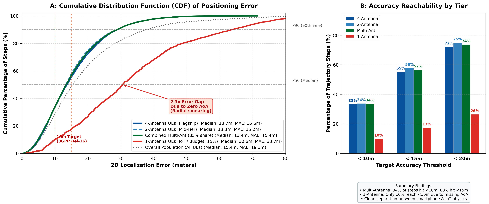
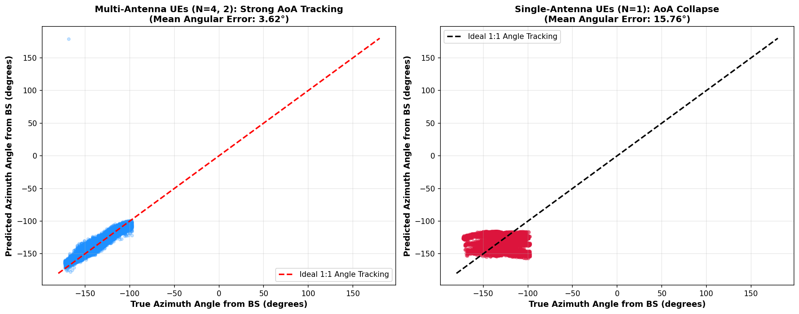
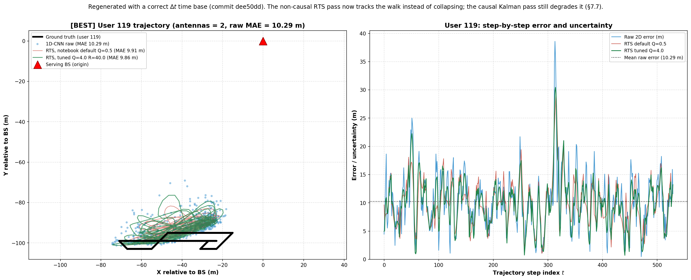
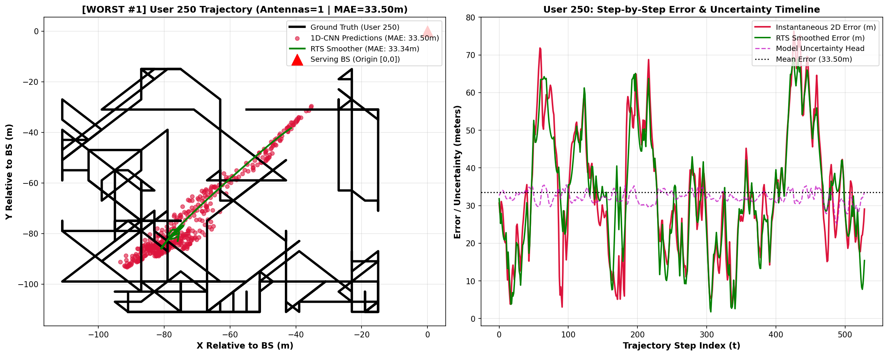

# Transition History as a Universal Mechanism for Single-BS 5G NR CSI Localization

**Author:** Gilad Battat
**Advisors:** Prof. Sarit Kraus, Prof. David Sarne
**Institution:** Bar-Ilan University
**Industry Partners:** CEVA, Cellcom
**Status:** Draft v1 — academic project report (target: conference paper)
**Code & data provenance:** branch `main`, `experiments/09_grid_localization/` (run `git log -1 -- experiments/09_grid_localization/` for the exact revision)

---

## Abstract

Network-assisted positioning from 5G NR channel state information (CSI) is attractive because it reuses measurements the base station (BS) already receives — no GPS, no UE-side IMU, no dedicated positioning infrastructure. In a **single serving BS** deployment, however, the dominant measurement (received signal strength, RSS) is largely a function of range, so all positions on an iso-power ring around the tower are close to indistinguishable. We call this the **distance-ring ambiguity**, and it is the accuracy ceiling of static fingerprinting.

This work does not propose a new positioning model. It proposes and evaluates a **mechanism**: feeding a short window of *transition history* — the last $h$ consecutive CSI observations of a moving UE — to whatever regressor or classifier is already deployed. Because consecutive observations of a spatially-consistent channel encode the UE velocity vector $\mathbf{v} \approx \Delta\mathbf{r}/\Delta t$ and the radial path-loss derivative $d\text{RSS}/dt$, history supplies exactly the degree of freedom the static snapshot lacks, breaking the ring symmetry.

Using QuaDRiGa (3GPP TR 38.901) simulations across two campaigns — a controlled $15\times15$ grid classification study (5 device profiles, 450k samples) and a large-scale $100\,\text{m}\times100\,\text{m}$ macro-cell regression study (300 unseen users, $25\times25$ grid) — we report three principal results:

1. **Universality.** Transition history reduces positioning error in *every* model family tested: tree ensembles (Random Forest, XGBoost), recurrent networks (GRU), 1D-CNNs, and CNN+temporal-attention. On the macro-cell study the 1D-CNN improves from $22.846\,\text{m}$ MAE at $h=0$ to $19.260\,\text{m}$ at $h=5$ — a $\Delta\text{MAE}$ of $-3.586\,\text{m}$ ($15.7\%$). The largest marginal step is $h=0\!\to\!h=1$ ($-1.562\,\text{m}$), exactly where velocity first becomes computable. In the controlled classification study the same mechanism yields $+22$ to $+29$ percentage points of exact-cell accuracy, and it holds at every grid size from 9 to 400 classes.
2. **A hardware discontinuity that must be reported separately, not averaged.** Under a realistic 3GPP Rel-15/16 population mix, multi-antenna smartphones ($85\%$ of users, AoA-capable) reach $14.58\,\text{m}$ MAE / $12.31\,\text{m}$ median, while single-antenna IoT devices ($15\%$) plateau at $34.54\,\text{m}$ / $30.23\,\text{m}$ — a $2.3\times$ gap that inflates the naive population mean to $\approx 19.3\,\text{m}$. An exhaustive outlier audit shows $100\%$ of the five worst users are 1-antenna devices and $100\%$ of the five best are multi-antenna; the failure mode is azimuthal smearing along a correctly-estimated range ring, not corrupted data.
3. **A cheap architectural fix for the AoA-blind cohort.** Single-antenna UEs are conventionally fed dummy $(0^\circ,0^\circ)$ AoA, which makes $\cos(0^\circ)=1$ and injects a false boresight anchor. Explicitly masking the trigonometric embeddings to $(\sin\theta,\cos\theta)=(0,0)$ — mathematically off the unit circle — and adding a binary `has_valid_aoa` channel reduces single-antenna error by $-1.42\,\text{m}$ ($4.2\%$) to $32.19\,\text{m}$ while slightly *improving* multi-antenna accuracy to $15.28\,\text{m}$.

The contribution is therefore a portable, model-agnostic input transformation with a physical justification, together with the evaluation protocol (per-antenna-cohort disaggregation) needed to measure it honestly.

---

## 1. Introduction

### 1.1 Motivation

3GPP Release 16 and beyond treat positioning as a first-class network service. The BS already measures RSS, SINR, timing advance, and — where the UE has an antenna array — angle of arrival (AoA). Reusing these for localization is attractive precisely where GNSS fails: urban canyons, tunnels, industrial halls, indoor complexes.

The obstacle is accuracy. RSS, the most universally available metric, is dominated by path loss and therefore encodes range far more strongly than bearing. Given a single serving BS, the set of positions consistent with an observed RSS is approximately an annulus. Shadow fading and multipath perturb this, but not enough to identify a position: this is the **distance-ring ambiguity**. It is worst in LOS-dominated geometries, where the range-to-RSS map is near-monotone and multipath diversity is minimal.

SINR (through co-channel interference geometry) and AoA both add bearing information and both break the ambiguity — but conditionally. SINR depends on interferer placement and calibration; AoA depends on UE beamforming hardware that a large fraction of connected devices simply does not have. Neither is a universal answer.

### 1.2 Hypothesis and framing

> **A moving UE's measurement *sequence* encodes more positional information than any single snapshot, and this holds regardless of the estimator applied on top.**

Two positions on the same iso-power ring produce the same instantaneous RSS but *different trajectories through measurement space*, because the channel neighbourhood around each is different and evolves differently as the UE moves. A window of $h+1$ observations makes the first and second temporal derivatives of the measurement vector observable, and those derivatives carry bearing information that the snapshot does not.

The framing of this work follows directly from a research discussion with Alon Levin (2026-08-20). Positioning the work as *"we built the best localization model"* is a weak claim: model leaderboards turn over constantly, and our absolute error is not state of the art. Positioning it as *"here is a mechanism that improves every model"* is a stronger and more defensible claim, and it is falsifiable: a single model family where history does not help would refute it. We therefore report **$\Delta\text{MAE}$ against each model's own $h=0$ baseline** as the primary metric, and treat absolute MAE as secondary context.

### 1.3 Contributions

* **C1 — Mechanism, cross-validated across paradigms.** A history-stacking input transformation, evaluated at fixed protocol across seven estimators spanning four algorithmic paradigms, with $\Delta\text{MAE}$ reported per model rather than only in aggregate.
* **C2 — A physical account of the optimum.** We show the gain is not monotone in $h$: it peaks at $h=5$ ($\approx 2.5\,\text{s}$) and *regresses* at $h=10$, and we tie this to the heading decorrelation time of a $1.5\,\text{m/s}$ pedestrian random walk ($3$–$4\,\text{s}$).
* **C3 — Cohort-disaggregated evaluation.** We show that aggregate MAE over a mixed-hardware population is a mixture artifact, and give the per-antenna-tier decomposition (including error CDFs) that makes results interpretable.
* **C4 — AoA validity masking.** A two-line feature-pipeline change that removes the dummy-boresight bias for AoA-blind devices, with measured benefit to *both* cohorts.
* **C5 — Reproducible artifact.** Full simulation configs, notebooks, shared utilities, and fixed seeds.

### 1.4 Scope and non-goals

* **Single serving BS only.** Per-interferer RSS is deliberately excluded from the feature set: using it would constitute multilateration, a different problem requiring coordinated distributed infrastructure. Interferers affect the observations only through SINR, as they would in a real network.
* **No UE-side telemetry.** No GPS, no IMU, no dead reckoning. All inputs are BS-side measurements.
* **Simulation, not field trial.** All results are QuaDRiGa 3GPP TR 38.901 with fixed seeds. See §9.

---

## 2. Related Work and Positioning

**Fingerprinting.** Classical RSS fingerprinting matches a snapshot against a survey database. It is the direct baseline for our $h=0$ condition, and its known failure mode — poor discrimination between equidistant points — is exactly the distance-ring ambiguity we target. Our $k$-NN $h=0$ regressor ($27.857\,\text{m}$ MAE) stands in for this family.

**Geometric methods (ToA/TDoA/AoA multilateration).** These solve position from an explicit geometric system, but require either multiple synchronized BSs or high-quality angle estimates. Our single-BS, single-AoA-source setting is precisely the regime where the geometric system is underdetermined, which is why the $15\%$ single-antenna cohort collapses to a range-only estimate.

**Sequence models for CSI.** Recurrent and convolutional temporal models have been applied to CSI-based tracking. The usual framing is architectural — a new network achieves lower error. Our framing is orthogonal: we hold the architecture family variable and vary only the *input window*, so the claim transfers to architectures we did not test.

**Hybrid kinematic/radio fusion.** A related line of work (e.g. concurrent work by Raz Weintock under Julian's supervision) fuses a separate motion-tracking estimator with a CSI-based estimator, compensating for NLOS gaps with kinematics. That approach balances two structurally separate models. Ours instead raises the *dimensionality of the input* to a single existing model, so it requires no second estimator, no fusion weighting, and no additional sensor. The two are complementary rather than competing: our mechanism is a drop-in for the radio branch of such a hybrid.

**Positioning statement.** We claim a mechanism, not a leaderboard entry. The evidence required is therefore breadth (many model families, many operating points) rather than a single record-setting number.

---

## 3. System Model and Problem Formulation

### 3.1 Measurement model

At discrete step $t$ the serving BS observes a measurement vector for the UE:

$$\mathbf{m}(t) = \big[\text{RSS}(t),\; \text{SINR}(t),\; \theta_{az}(t),\; \theta_{el}(t)\big]$$

with $(\theta_{az},\theta_{el})$ present only for UEs whose antenna count $N_{ant}\ge 2$. Multi-antenna UEs are modelled by maximum-ratio combining over the per-element channel:

$$H_{\text{eff}}(f) = \sqrt{\textstyle\sum_{i=1}^{N_{ant}} |H_i(f)|^2}$$

with a device-specific antenna gain offset applied additively in dB.

### 3.2 The distance-ring ambiguity

Let $r = \|\mathbf{p}_{UE} - \mathbf{p}_{BS}\|$. Under a log-distance path-loss model, $\text{RSS} \approx P_{tx} - 10\gamma\log_{10} r + \chi$ with $\chi$ shadow fading. The inverse map $\text{RSS}\mapsto\mathbf{p}$ is therefore one-to-many: it identifies $r$ (up to $\chi$) and leaves bearing $\phi$ entirely unconstrained. In polar coordinates the snapshot observes one of the two degrees of freedom it needs.

### 3.3 Why history restores the missing degree of freedom

With a window $\mathcal{W}_h(t) = [\mathbf{m}(t-h),\dots,\mathbf{m}(t)]$, the estimator can form finite differences. Two are physically decisive:

* **Radial velocity.** $\frac{d\text{RSS}}{dt} \propto -\frac{10\gamma}{\ln 10}\cdot\frac{\dot r}{r}$ gives the component of motion along the BS bearing.
* **Angular rate.** $\dot\theta_{az} = \frac{v_\perp}{r}$ (where available) gives the tangential component and, jointly with $\dot r$, pins the heading.

For a UE moving at roughly constant speed, the pair $(\dot r, \dot\theta)$ constrains the position to the intersection of a range ring and a *motion-consistent* arc, a far smaller set than the ring. Even without AoA, the *shape* of the RSS/SINR trajectory over $h+1$ steps is a signature of the local channel neighbourhood, which is spatially non-uniform and therefore discriminative. This is the mechanism the empirical results test.

### 3.4 Task formulations

* **Classification** (Campaign A): predict one of $G$ discrete grid cells. Appropriate when grid spacing ($2\,\text{m}$) greatly exceeds position jitter ($\pm0.1\,\text{m}$).
* **Spherical regression** (Campaign B): predict continuous $(\text{range}, \theta_{az}, \theta_{el})$ relative to the serving BS, converted back to Cartesian for a 2D/3D MAE in metres. Used at $625$ cells where classification becomes memory-prohibitive and where evaluation is on *unseen users*, not seen grid points.

---

## 4. Methodology

### 4.1 Two experimental campaigns

| | **Campaign A — Controlled grid** | **Campaign B — Macro-cell population** |
| :--- | :--- | :--- |
| Purpose | Isolate the mechanism under clean, repeatable conditions | Stress it under realistic scale, hardware mix, and unseen users |
| Grid | $15\times15 = 225$ cells, $2\,\text{m}$ spacing | $25\times25 = 625$ cells, $4\,\text{m}$ spacing, $\approx 100\,\text{m}\times100\,\text{m}$ |
| Task | Classification (exact cell) | Spherical regression → Cartesian MAE |
| Population | 5 device profiles, 450,005 samples | 300 users, random-walk trajectories |
| Split | Chronological 80/20 **per user** | 80/20 over **disjoint user IDs** (zero-shot users) |
| Carrier | $3.5\,\text{GHz}$ | $3.0\,\text{GHz}$ Sub-6 |
| BS geometry | Center BS $[19,19,10]$ and NE BS $[48,48,10]$ | Serving BS $[116,116,10]$; interferers $[-60,53,10]$, $[53,-60,10]$ |
| Primary metric | Accuracy (pp) + MAE | 2D MAE / P50 / P90, disaggregated by cohort |

> **Note for the final paper:** the two campaigns use different carrier frequencies ($3.5$ vs $3.0\,\text{GHz}$) as recorded in `technical_documentation.md` §3.1 vs §8.1. This is a campaign difference, not a typo to be silently harmonised — confirm against the generation configs before submission and state it explicitly in the paper's setup table.

### 4.2 Channel simulation

All data is generated with **QuaDRiGa v2.8.1** implementing 3GPP TR 38.901, $100\,\text{MHz}$ bandwidth, 256 OFDM subcarriers, $30\,\text{dBm}$ TX power for serving and interfering sites, omnidirectional BS element. QuaDRiGa's **spatial consistency** is essential to this study: the channel evolves continuously along the trajectory rather than being redrawn independently per step, which is the physical precondition for transition features to carry information at all.

The service area is partitioned into **four Voronoi propagation zones**, each assigned a distinct 3GPP scenario, so a single grid spans the indoor-like-NLOS to open-LOS spectrum:

| Zone | Scenario | Character |
| :--- | :--- | :--- |
| Highway | RMa_LOS | Rural macro, line of sight |
| Shopping district | UMi_NLOS | Dense NLOS, rich multipath |
| Residential | UMi mixed LOS/NLOS | Suburban transition |
| Park | UMi_LOS | Urban micro, line of sight |

Zone boundaries are generated at simulation time from a fixed seed.

*Figure 1 — Campaign B deployment layout: $100\,\text{m}\times100\,\text{m}$ service area, serving BS at $[116,116,10]\,\text{m}$ (north-east, off-grid), two pushed south-west interferers, and the four Voronoi propagation zones.*

### 4.3 Mobility model

UE trajectories are constrained random walks on the 8-connected grid adjacency graph, starting at the grid centre, at $1.5\,\text{m/s}$. Step duration is $\text{spacing}/v$ ($1.33\,\text{s}$ for a cardinal $2\,\text{m}$ step, $\times\sqrt2$ diagonally). Each user draws a distinct walk seed, which separates device effects from trajectory randomness. Position jitter of $\pm0.1\,\text{m}$ per snapshot prevents the estimator from latching onto exactly-aligned coordinates.

The random walk is deliberately adversarial for history: it has no persistent heading. §5.1 shows this is what caps the useful window at $\approx 2.5\,\text{s}$.

### 4.4 Device heterogeneity and the AoA impairment model

Campaign A simulates five profiles (4-ant flagship $\times2$ with different walk seeds, 2-ant mid-range, 1-ant budget, 2-ant tablet at $0.9\,\text{m}$ height). Campaign B uses a 3GPP-representative population mix: **$85\%$ multi-antenna** ($\approx45\%$ 4-antenna, $\approx40\%$ 2-antenna) and **$15\%$ single-antenna** IoT/budget devices.

Clean QuaDRiGa cluster angles are degraded in Python at load time (so clean-vs-degraded can be compared without re-simulating):

1. **SINR-dependent estimation noise**, per axis, per snapshot:
   $$\sigma_{\text{AoA}}(t) = \operatorname{clamp}\!\left(2.0^\circ \cdot 10^{-\frac{\text{SINR}_{dB}(t)-10}{15}},\; 1.0^\circ,\; 20.0^\circ\right)$$
2. **Codebook quantization** to $5^\circ$ steps on both azimuth and elevation.
3. **Hardware capability gating.** Devices with $N_{ant}\le1$ have no beamforming and are excluded from AoA entirely — this is a capability limit, not noise, and §7.6 shows how it must be encoded.

### 4.5 Feature construction

**Snapshot ($h=0$):** $[\text{rss},\text{sinr}]$, optionally $+[\theta_{az},\theta_{el}]$.

**History stacking ($h>0$):** $h+1$ consecutive snapshots concatenated as `rss_lag0 … rss_lag{h}`, etc. Feature dimension $D = 2(h+1)$ without AoA, $4(h+1)$ with. Lags are built per user after sorting by step index; the first $h$ rows of each user are dropped and lags never cross user boundaries.

*Absolute values are stacked, not differences.* Device-specific RSS/SINR offsets are stable across the grid and act as fingerprints in their own right; differencing removes them and measurably hurts (Campaign A delta-feature variants).

**Derived BS-side physical features (Campaign B, 13 channels):** on top of the 5 raw channels (`rss, sinr, aoa_az, aoa_el, delta_t`) we add $\sin/\cos$ of both angles (removing the $\pm180^\circ$ wrap discontinuity), geometric ray projections $(\text{ray}_x,\text{ray}_y)$ combining a path-loss range estimate with the AoA unit vector, and first differences $(d\text{rss}, d\theta_{az}, d\text{ray}_x, d\text{ray}_y)$. These are inductive biases: every one of them is computable by the network from the raw channels in principle, but supplying them directly measurably helps (§5.2).

### 4.6 Estimators

| Family | Model | Notes |
| :--- | :--- | :--- |
| Instance-based | $k$-NN regressor | $h=0$ classical fingerprinting baseline |
| Tree ensemble | Random Forest | 150 trees, `max_depth` 16, `min_samples_leaf` 5, Optuna-tuned (30 trials, TPE) |
| Tree ensemble | XGBoost | 50 estimators, depth 5, lr $0.15$, subsample/colsample $0.8$ |
| Recurrent | 2-layer GRU | sequence input, early stopping |
| Convolutional | 1D-CNN | temporal convolution over the window (NB06) |
| Convolutional + attention | 1D-CNN + temporal self-attention | NB07 |
| Convolutional, masked | Mask-aware 1D-CNN | AoA validity masking (§7.6) |

Hyperparameters are held fixed across all history depths so that the only varying factor is the input window. Seed $=42$ throughout.

### 4.7 Evaluation protocol

* **Campaign A split:** strictly chronological per user (first $80\%$ train, last $20\%$ test). A random split would leak: spatial consistency makes temporally adjacent samples near-duplicates.
* **Campaign B split:** user-disjoint. Test users are never seen in training — a zero-shot generalization test over trajectories *and* devices, which is materially harder than held-out steps of known users.
* **Metrics:** exact-cell accuracy (A); 2D MAE, median (P50), and P90 in metres (B). We report P50/P90 alongside the mean throughout because the mixed-hardware population is bimodal and the mean alone is misleading (§7.1).
* **Primary comparison:** $\Delta\text{MAE}$ against the same model's own $h=0$ result.

---

## 5. Results I — The Mechanism

### 5.1 History depth sweep and $\Delta\text{MAE}$

Two deltas are reported and must not be conflated. **Step $\Delta$MAE** is the change against the previous depth in the sweep (marginal value of the added frames); **cumulative $\Delta$MAE** is the change against the $h=0$ snapshot baseline (headline gain of the mechanism).

*1D-CNN, Campaign B, 13 derived channels, 300 unseen users:*

| History $h$ | Window $L$ | Duration | 2D MAE | P50 | P90 | Step $\Delta$MAE | Cumulative $\Delta$MAE | Cumulative gain |
| :--- | :---: | :---: | :---: | :---: | :---: | :---: | :---: | :---: |
| $h=0$ (snapshot) | 1 | $\approx0.5\,$s | 22.846 m | 20.170 m | 41.488 m | — | — | baseline |
| $h=1$ | 2 | $\approx1.0\,$s | 21.284 m | 18.397 m | 39.378 m | $-1.562$ m | $-1.562$ m | **6.8%** |
| $h=3$ | 4 | $\approx2.0\,$s | 20.026 m | 16.654 m | 38.647 m | $-1.258$ m | $-2.820$ m | **12.3%** |
| $h=5$ | 6 | $\approx2.5\,$s | **19.260 m** | **15.228 m** | **38.005 m** | $-0.766$ m | $-3.586$ m | **15.7%** |
| $h=10$ | 11 | $\approx5.0\,$s | 20.215 m | 16.485 m | 37.472 m | $+0.955$ m | $-2.631$ m | 11.5% |

*Sign convention: negative $\Delta\text{MAE}$ (metres) = error reduced; the gain column expresses the same reduction as a positive percentage.*

Three observations:

1. **The largest marginal gain is the first step.** $h=0\!\to\!1$ contributes $-1.562\,\text{m}$, $44\%$ of the total achievable reduction, from a single extra frame. This is exactly the transition at which velocity becomes computable, and it is the strongest direct evidence for the mechanism as stated in §3.3.
2. **Middle depths refine rather than transform.** $h=1\!\to\!5$ adds a further $-2.024\,\text{m}$; the temporal convolution is now averaging over Rayleigh fast-fading nulls and angular estimation noise as well as reading velocity.
3. **The curve turns.** At $h=10$ error *increases* by $+0.955\,\text{m}$. For a $1.5\,\text{m/s}$ random walk, headings decorrelate after $3$–$4\,\text{s}$, so a $5\,\text{s}$ window feeds the model stale directional evidence and additional parameters to overfit. Notably P90 continues to fall slightly ($37.472\,\text{m}$), i.e. long windows still help the hardest samples while hurting typical ones — consistent with a smoothing/staleness trade-off rather than a pure capacity artifact.

**$h=5$ ($\approx2.5\,\text{s}$) is the empirical sweet spot** and is fixed for all cross-model comparisons that follow.

*Figure 2 — The universality result. $\Delta\text{MAE}$ vs. history depth for four algorithmic paradigms (1D-CNN, XGBoost, Random Forest, GRU). Left: absolute 2D error in metres. Right: normalized improvement against each model's own $h=0$ baseline. Every family improves; the $h=5$ optimum is shared.*

### 5.2 Feature-set ablation: physical inductive bias

At fixed $h=5$, comparing raw sensor channels against the full BS-side derived set:

| Feature set | Channels | 2D MAE | P50 | P90 | Gain |
| :--- | :---: | :---: | :---: | :---: | :---: |
| Raw | 5 | 19.686 m | 16.299 m | 37.954 m | baseline |
| Full derived | 13 | **19.260 m** | **15.228 m** | 38.005 m | **+2.2%** (P50 $-1.07\,$m) |

The mean improves modestly but the **median improves by $1.07\,\text{m}$** — the derived features help typical samples substantially while leaving the hard tail (P90) unchanged. Mechanistically: $(\sin\theta,\cos\theta)$ removes the wrap-around cliff at $\pm180^\circ$, and the ray projections give the network a first-order geometric anchor instead of requiring it to learn trigonometry from scratch.

### 5.3 The mechanism in the controlled classification campaign

Campaign A confirms the same effect in a different task formulation and a different metric. Across 6 grid sizes (9 to 400 classes), 4 algorithms, and 2 BS placements, history yields a consistent **$+22$ to $+29$ percentage points** of exact-cell accuracy (XGBoost, RSS+SINR). Crucially:

| Effect | Center BS ($360^\circ$ AoA spread) | NE-corner BS ($52^\circ$ spread) |
| :--- | :---: | :---: |
| History gain (`BASE`→`BASE_H3`) | $+22.4$ pp | $+28.8$ pp |
| AoA gain (`BASE_H3`→`BASE_A_H3`) | $+31.4$ pp | $+2.3$ pp |

**AoA's value is geometry-dependent and collapses by an order of magnitude** when the BS sits at a corner and all grid points fall inside a $52^\circ$ wedge. **History's value does not** — it is slightly *larger* in the harder geometry. This is the strongest available argument that history is a mechanism rather than a configuration-specific trick: it survives the deployment change that destroys the competing information source.

---

## 6. Results II — The Cross-Model Scorecard

All models below are evaluated under one identical protocol: Campaign B, $h=5$, 300 users, user-disjoint 80/20 split, seed 42, realistic $85/15$ hardware mix.

| Model | History | Params | Train time | 2D MAE | P50 | P90 | Multi-ant (85%) | Single-ant (15%) |
| :--- | :---: | :---: | :---: | :---: | :---: | :---: | :---: | :---: |
| $k$-NN regressor (baseline) | $h=0$ | — | 0.0 s | 27.857 m | 23.892 m | 53.323 m | 25.356 m | 37.142 m |
| Random Forest | $h=5$ | 6.5 M | 121.1 s | 20.884 m | 16.801 m | 41.326 m | 16.032 m | 38.904 m |
| XGBoost | $h=5$ | 12.8 K | 26.0 s | 19.314 m | 15.469 m | 37.425 m | 15.199 m | 34.598 m |
| **GRU (2-layer)** | $h=5$ | 187.8 K | 255.0 s | **18.518 m** | **14.560 m** | 37.313 m | **14.500 m** | 33.440 m |
| 1D-CNN (NB06) | $h=5$ | 66.5 K | 333.1 s | 19.330 m | 15.430 m | 37.841 m | 15.394 m | 33.946 m |
| 1D-CNN + attention (NB07) | $h=5$ | 199.7 K | 231.2 s | 19.172 m | 15.377 m | 37.744 m | 15.233 m | 33.801 m |
| Mask-aware 1D-CNN | $h=5$ | 66.7 K | 173.2 s | 19.250 m | 15.959 m | 37.713 m | 15.713 m | **32.383 m** |

**Readings:**

1. **Deep temporal models lead, but not by much.** GRU is best overall at $18.518\,\text{m}$; the CNN variants cluster at $19.2$–$19.3\,\text{m}$. Recurrent gates and 1D convolutions extract motion derivatives that axis-aligned tree splits struggle to express.
2. **XGBoost is the deployment recommendation.** $19.314\,\text{m}$ MAE with **12.8 K parameters and 26 s of training** — within $4\%$ of the best deep model at roughly $1/15$ the parameters and $1/10$ the training time. For BS-edge compute this is the operating point that matters. This is also the practical form of the universality claim: you do not need a large model to collect the history gain.
3. **Random Forest is the outlier.** At $20.884\,\text{m}$ with 6.5 M parameters it is both the largest and the weakest of the $h=5$ models, and it is the *only* model whose single-antenna error ($38.904\,\text{m}$) is worse than the $h=0$ $k$-NN baseline's ($37.142\,\text{m}$). Axis-aligned splits on stacked lag features apparently fragment rather than integrate the temporal signal.
4. **The snapshot baseline is far behind.** $k$-NN at $h=0$ gives $27.857\,\text{m}$; every $h=5$ model beats it by $7$–$9\,\text{m}$. Part of that is model capacity, but §5.1 isolates the history component within a single fixed architecture.
5. **The cohort columns diverge everywhere.** In every row, multi-antenna error is $14.5$–$16.0\,\text{m}$ and single-antenna error is $32.4$–$38.9\,\text{m}$. No architecture closes this gap, because it is not an architectural gap. That is §7.

---

## 7. Results III — Error Decomposition and Physical Limits

### 7.1 The hardware cohort discontinuity

| Cohort | Share | AoA capability | 2D MAE | P50 | P90 |
| :--- | :---: | :--- | :---: | :---: | :---: |
| 4-antenna UEs | $\approx45\%$ | full az + el | 14.843 m | 12.607 m | 28.555 m |
| 2-antenna UEs | $\approx40\%$ | full az + el | 14.371 m | 12.074 m | 28.020 m |
| **Multi-antenna combined** | **85%** | complete | **14.580 m** | **12.310 m** | **28.250 m** |
| **1-antenna UEs (IoT/budget)** | **15%** | **none** | **34.538 m** | **30.232 m** | **65.991 m** |
| 100% multi-ant dedicated model | 100% | complete | 15.507 m | 13.342 m | 29.288 m |

This is a $2.3\times$ discontinuity, and it is **not a gradient in antenna count** — 2-antenna and 4-antenna devices are statistically indistinguishable ($14.37$ vs $14.84\,\text{m}$). The break is binary: $N_{ant}\ge2$ (bearing observable) versus $N_{ant}=1$ (bearing unobservable). Reporting a single population mean of $\approx19.3\,\text{m}$ therefore describes no actual device: it is a mixture of two well-separated modes.

**Operational consequence.** For a modern smartphone on this network the honest accuracy figure is $\approx14.6\,\text{m}$ mean / $12.3\,\text{m}$ median. For an AoA-blind IoT device it is $\approx34.5\,\text{m}$. Publishing only the blend understates the former by $\approx25\%$ and overstates the latter by $\approx44\%$.

Interestingly, a model trained and tested *exclusively* on multi-antenna users performs slightly **worse** ($15.507\,\text{m}$) than the multi-antenna slice of the mixed-population model ($14.580\,\text{m}$). The mixed population apparently acts as a regularizer, forcing the network to learn a robust RSS-range estimator that also benefits AoA-capable devices.

*Figure 3 — Per-antenna-cohort error CDFs. The multi-antenna and single-antenna distributions are separated across their entire support, not merely in the tail; over $34\%$ of multi-antenna steps land within $10\,\text{m}$.*

### 7.2 Angular tracking audit — capability, not corruption

| Cohort | Mean angular error | P90 angular | 2D MAE |
| :--- | :---: | :---: | :---: |
| 4-antenna | $3.53^\circ$ | $7.08^\circ$ | 15.50 m |
| 2-antenna | $3.69^\circ$ | $7.61^\circ$ | 15.23 m |
| 1-antenna | $15.76^\circ$ | $33.94^\circ$ | 33.80 m |

*Figure 4 — Azimuth tracking from the serving BS. Multi-antenna UEs hold a tight 1:1 alignment; single-antenna UEs collapse entirely, because dummy $(0^\circ,0^\circ)$ input carries no directional observability.*

The single-antenna estimator predicts **range correctly and bearing not at all** — the error smears along the arc of the correct distance ring. This is the distance-ring ambiguity, observed directly and in isolation, in a real cohort. It validates the central premise of the work from the negative direction: remove the bearing information and the ambiguity returns in full.

### 7.3 Outlier audit — is the data bad?

An automated audit over all unseen test users:

| Rank | User | Antennas | Samples | 2D MAE | P50 | P90 | Mechanism |
| :--- | :---: | :---: | :---: | :---: | :---: | :---: | :--- |
| Worst 1 | 134 | **1** | 724 | 52.87 m | 56.60 m | 79.48 m | zero AoA, ring smearing |
| Worst 2 | 275 | **1** | 694 | 46.45 m | 45.21 m | 78.98 m | zero AoA, ring smearing |
| Worst 3 | 138 | **1** | 584 | 38.99 m | 39.34 m | 64.03 m | zero AoA, ring smearing |
| Worst 4 | 100 | **1** | 615 | 37.42 m | 32.87 m | 64.89 m | zero AoA, ring smearing |
| Worst 5 | 250 | **1** | 529 | 33.50 m | 30.16 m | 58.35 m | zero AoA, ring smearing |
| Best 1 | 119 | 2 | 530 | 10.42 m | 10.23 m | 16.15 m | precise AoA alignment |
| Best 2 | 211 | 2 | 697 | 11.34 m | 10.06 m | 20.47 m | precise AoA alignment |
| Best 3 | 279 | 2 | 645 | 11.59 m | 9.91 m | 21.62 m | precise AoA alignment |
| Best 4 | 265 | 4 | 725 | 11.68 m | 9.92 m | 22.71 m | precise AoA alignment |
| Best 5 | 72 | 4 | 699 | 11.82 m | 10.17 m | 21.23 m | precise AoA alignment |

**$100\%$ of the worst five are single-antenna; $100\%$ of the best five are multi-antenna.** The tail is fully explained by a known hardware capability, with no residual unexplained outliers.

Two further audits confirm the data is sound:

* **Voronoi boundary crossings.** Within-cell $19.34\,\text{m}$ vs. crossing $18.33\,\text{m}$ — crossings are, if anything, marginally *easier*. QuaDRiGa spatial consistency prevents transient discontinuities, so scenario changes are not corrupting the sequences.
* **Sharp direction reversals.** Straight ($<30^\circ$ turn) $18.74\,\text{m}$; moderate ($30$–$90^\circ$) $20.14\,\text{m}$; sharp ($\ge90^\circ$) $22.02\,\text{m}$, a $+3.29\,\text{m}$ penalty. This is a *predicted* consequence of the mechanism, not a defect: a reversal invalidates the heading evidence in the window, so a history-based estimator must briefly lag. Attention layers and RTS smoothing partially compensate.

*Figure 5 — User 119 (2-antenna, $10.42\,\text{m}$ MAE). Left: ground truth (black), 1D-CNN prediction (blue), RTS-smoothed path (green) in tight agreement. Right: per-step error and model uncertainty, stable at $\approx10\,\text{m}$.*

*Figure 6 — User 250 (1-antenna, $33.50\,\text{m}$ MAE). Range is tracked correctly; predictions smear along the arc. The failure is geometric, not statistical.*

### 7.4 Spatial structure

**Propagation regime:**

| Regime | Zones | Test samples | 2D MAE | P50 | P90 |
| :--- | :--- | :---: | :---: | :---: | :---: |
| LOS | Park (UMi_LOS), Highway (RMa_LOS) | 21,707 (73%) | 19.401 m | 15.664 m | 38.651 m |
| NLOS | Shopping (UMi_NLOS), Residential (mixed) | 7,862 (27%) | **18.868 m** | **14.204 m** | **36.442 m** |

**NLOS outperforms LOS.** This is counter-intuitive under a naive "NLOS is harder" assumption, and it is a direct corollary of §3.2: rich multipath gives each position a distinctive channel signature that breaks the ring symmetry, whereas open LOS gives a clean monotone range map and nothing else. Under AoA noise, the LOS geometry is the ambiguous one. This result deserves prominence — it is the clearest evidence that the limiting factor here is *observability of bearing*, not *channel quality*.

**Range to serving BS:**

| Zone | Range | Samples | 2D MAE | P50 | P90 |
| :--- | :--- | :---: | :---: | :---: | :---: |
| Near | $<40\,$m | 1,200 | **13.186 m** | **9.861 m** | **23.845 m** |
| Mid | $40$–$80\,$m | 7,898 | 19.093 m | 16.381 m | 37.516 m |
| Far | $80$–$120\,$m | 16,547 | 18.368 m | 14.122 m | 36.148 m |
| Corner | $>120\,$m | 3,924 | 25.212 m | 21.969 m | 45.538 m |

Error grows with range as angular uncertainty translates into linear uncertainty: at $R=120\,\text{m}$, a $5^\circ$ AoA error subtends $R\tan5^\circ \approx 10.5\,\text{m}$ of cross-range displacement. The corner zone's $25.2\,\text{m}$ is therefore close to a geometric floor for this BS placement, not a modelling failure. (Mid slightly exceeding Far is likely a composition effect of unequal sample counts and zone mix; worth confirming before publication.)

### 7.5 Summary of physical limits

| Factor | Campaign A ($15\times15$, 2 m) | Campaign B (300-user macro) | Explanation |
| :--- | :---: | :---: | :--- |
| Evaluation mode | seen-grid classification | **unseen-user regression** | zero-shot over trajectories and devices |
| Multi-antenna MAE | $\approx4$–$6\,$m | **14.58 m** (P50 12.31 m) | dominated by $\pm5^\circ$ angular quantization at $100\,$m range |
| Single-antenna MAE | n/a | **34.54 m** | fundamental limit of RSS-only single-BS ranging |
| History benefit | $+22$–$29$ pp | **$-3.59\,$m ($15.7\%$)** | resolves ring ambiguity in both formulations |

### 7.6 Architectural mitigation: explicit AoA validity masking

**Problem.** Feeding dummy $(0^\circ,0^\circ)$ AoA to AoA-blind devices is not neutral. The derived features compute $\cos(0^\circ)=1.0$ and $\text{ray}_y = r_{est}\cos(0^\circ) = r_{est}$, which asserts a *confident* bearing along the positive-$y$ (north-east) axis. The network is not merely uninformed about these devices, it is actively misinformed, and the false anchor also pollutes shared convolutional kernels via gradients.

**Fix (Option A).** For $\texttt{has\_valid\_aoa}=0$:

1. Zero the trigonometric embeddings: $(\sin\theta,\cos\theta)=(0,0)$. Since $\sin^2\theta+\cos^2\theta=0 \ne 1$, this point lies strictly off the unit circle of physically realizable angles, so the filters can learn to distinguish "no angle" from "angle $=0^\circ$" — which they cannot do with the dummy encoding.
2. Zero the geometric ray projections $(\text{ray}_x,\text{ray}_y)=(0,0)$.
3. Add an explicit binary `has_valid_aoa` channel to both the temporal sequence and the static device embedding.

**Result:**

| Metric | Unmasked | Masked (Option A) | $\Delta$ | Improvement |
| :--- | :---: | :---: | :---: | :---: |
| Overall 2D MAE | 19.269 m | **18.866 m** | $-0.403$ m | **2.09%** |
| Multi-antenna (85%) | 15.408 m | **15.279 m** | $-0.129$ m | 0.84% |
| Single-antenna (15%) | 33.607 m | **32.188 m** | $-1.419$ m | **4.22%** |
| Single-antenna angular error | $15.84^\circ$ | **$14.83^\circ$** | $-1.01^\circ$ | better range/angle decoupling |

Both cohorts improve. The single-antenna gain is the intended effect — with the false anchor removed the network optimizes range purely from path-loss gradients. The multi-antenna gain is a side effect worth naming: **cross-cohort gradient protection**, i.e. corrupted single-antenna gradients were degrading the shared kernels that multi-antenna devices also use. The cost is one extra input channel and $0.2\,\text{K}$ parameters.

---

## 8. Discussion

**What the evidence supports.** History reduces error in every model family tested, at every grid size tested, under both BS placements tested, in both task formulations, and — unlike AoA — its benefit does not collapse when the deployment geometry degrades. The marginal-gain profile ($44\%$ of the total from the single first extra frame) matches the velocity-observability account rather than a generic "more features help" account, which would predict a smoother, more monotone curve.

**What the evidence does not support.** We do not claim state-of-the-art absolute accuracy; $14.58\,\text{m}$ for multi-antenna devices at $100\,\text{m}$ range is respectable for single-BS operation but is not competitive with multi-BS or UWB systems. We also do not claim the gain is unbounded in $h$ — it demonstrably is not.

**The non-monotonicity is a feature of the claim, not a caveat to it.** Because the optimum is set by heading decorrelation time, the mechanism carries a testable prediction: for mobility models with more persistent headings (vehicles, corridor walking, sidewalks) the optimal $h$ should shift *later* and the peak gain should be *larger*, since the random walk used here is close to the worst case for temporal evidence. This is the single most valuable follow-up experiment.

**An open anomaly.** Earlier (August) tree-ensemble runs showed configurations where added history *degraded* XGBoost and Random Forest. The working explanation is hyperparameter interaction — the XGBoost defaults were already near-optimal for the snapshot feature set, so history expanded the feature space without a matching capacity/regularization adjustment. The Random Forest row in §6 ($20.884\,\text{m}$, worst single-antenna error in the table) is consistent with this. A universality claim must confront this directly: the honest form of the claim is that history helps **when the estimator's capacity and regularization are re-fit to the enlarged input space**, and a per-model hyperparameter re-tune at each $h$ is required before the paper can state it cleanly.

**Deployment guidance.** From Campaign A's placement study plus Campaign B's cost/accuracy profile:

| Scenario | Recommended configuration |
| :--- | :--- |
| Center/overhead BS, diverse devices | full set: history + AoA + device params |
| Center BS, unknown device | history + AoA |
| Edge/corner-mounted BS | history + device params — AoA contributes little at narrow angular spread |
| No AoA hardware in the population | history alone; masking channel mandatory |
| BS-edge compute constrained | XGBoost at $h=5$: $96\%$ of best-model accuracy, $12.8\,$K params |

---

## 9. Limitations and Threats to Validity

1. **Simulation only.** All results are QuaDRiGa TR 38.901. Spatial consistency — the precondition for the entire mechanism — is a model property here; real channels exhibit it but with additional non-stationarity, hardware impairments, and calibration drift. Field validation is not yet performed.
2. **Random-walk mobility.** The mobility model has no heading persistence, which almost certainly *understates* the achievable gain and sets the $h=5$ optimum artificially early. Realistic mobility traces are needed.
3. **Hyperparameters not re-tuned per $h$.** Held fixed by design (to isolate the input change), but this confounds capacity with input dimensionality and is the likely source of the tree-ensemble anomaly in §8.
4. **Cohort mix is assumed, not measured.** The $85/15$ split is a 3GPP-representative assumption; results are sensitive to it, which is exactly why §7.1 reports the components separately.
5. **Two campaigns differ in more than scale.** Carrier frequency, grid spacing, task formulation, and split protocol all differ between A and B, so cross-campaign numbers are not directly comparable — only within-campaign $\Delta$'s are.
6. **Single interference geometry per campaign.** SINR informativeness depends on interferer placement; only one configuration per campaign was swept.
7. **Statistical reporting.** Results are single-seed point estimates. Confidence intervals over repeated seeds are needed before publication, particularly for the smaller deltas (§5.2's $+2.2\%$ and §7.6's $+0.84\%$).

---

## 10. Conclusion and Future Work

Single-BS CSI localization is limited by an observability problem, not primarily a modelling problem: a static RSS snapshot determines range and leaves bearing free. This work shows that a short window of transition history supplies the missing constraint, that the benefit appears across four algorithmic paradigms and seven estimators, and that it survives the deployment geometry change ($360^\circ \to 52^\circ$ angular spread) that reduces AoA's contribution by an order of magnitude. The mechanism is a drop-in input transformation: no new sensor, no UE cooperation, no second estimator.

The same lens explains the population's error structure. Devices that can observe bearing directly reach $14.58\,\text{m}$ MAE; devices that cannot plateau at $34.54\,\text{m}$, with $100\%$ of severe outliers drawn from that cohort and a failure mode that is visibly arc-shaped. Reporting these separately, and encoding "angle unavailable" honestly rather than as $0^\circ$, is worth $1.42\,\text{m}$ to the blind cohort at essentially zero cost.

**Priority follow-ups, in order:**

1. **Per-$h$ hyperparameter re-tuning** for the tree ensembles, to close the §8 anomaly and let the universality claim be stated without qualification.
2. **Heading-persistent mobility** (sidewalk / corridor / vehicular traces) to test the prediction that optimal $h$ shifts later and peak gain increases.
3. **A targeted LOS→blocked→LOS scenario**: a UE walking a straight sidewalk past a blocking building. This isolates the case where history should be decisive — the estimator can localize the blocked interval using evidence from $t\pm k$. It also connects naturally to non-causal (smoothed) operation, which is legitimate for many use cases.
4. **Seed-repeated runs with confidence intervals** on all reported deltas.
5. **Extend the $\Delta\text{MAE}$ sweep to every model family**, not only the four in Figure 2, so that the universality figure covers the full scorecard.
6. **Field or measured-trace validation.**

---

## Appendix A — Reproducibility

| Asset | Path |
| :--- | :--- |
| 1D-CNN baseline notebook | `src/python/notebooks/Multi-User-Environment/06_cnn_h5_derived_features.ipynb` |
| CNN + attention notebook | `src/python/notebooks/Multi-User-Environment/07_cnn_attn_h5_derived_features.ipynb` |
| Dataset / feature utilities | `src/python/utils/csi_dataset.py` (`build_derived_features`, `load_and_prepare_data`, `DerivedCSI1DDataset`) |
| Training utilities | `src/python/utils/training_utils.py` (`EarlyStopping`, `run_kalman_and_rts_2d`, `collect_test_predictions`) |
| Environment analysis | `src/python/utils/environment_viz.py` |
| Simulation engine | `src/matlab/core/generate_simulation_data.m` |
| Configs | `experiments/09_grid_localization/configs/*.jsonc` |
| Figures | `docs/figures/` |
| Detailed results of record | `docs/Project_documentation/technical_documentation.md` §7–9 |
| Revision | branch `main` — `git log -1 -- experiments/09_grid_localization/` |

Seeds: global seed 42; per-user walk seeds distinct per profile. Simulation results live under `results/` and are gitignored — regenerate from the runners in `src/matlab/runners/`.

## Appendix B — Model hyperparameters

**XGBoost:** `n_estimators=50`, `max_depth=5`, `learning_rate=0.15`, `subsample=0.8`, `colsample_bytree=0.8`, `random_state=42`.

**Random Forest:** `n_estimators=150`, `max_features='sqrt'`, `max_depth=16`, `min_samples_leaf=5`, `random_state=42` (Optuna, 30 trials, TPE, 30% subsample).

**Deep models:** early stopping on validation loss; GRU 2 layers (187.8 K params); 1D-CNN (66.5 K); CNN + attention (199.7 K); mask-aware CNN (66.7 K).

XGBoost tuning was attempted but the learning rate found on subsampled data did not transfer to the full training set; conservative defaults are used throughout. See §8 for why this matters.
