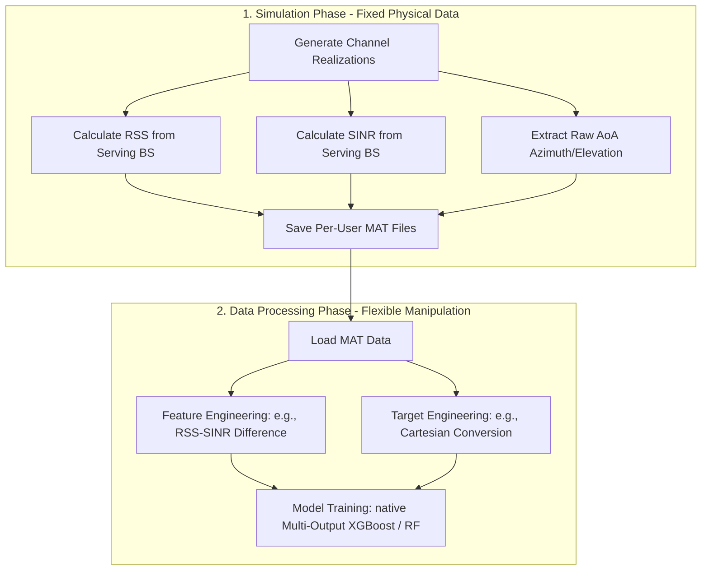

# Proposed Python Pipeline Improvements (Cartesian Localization)

This document outlines proposed enhancements to the Python-based machine learning pipeline for 25x25 grid localization. It categorizes tasks between the **MATLAB Simulation Phase** (fixed data data generation) and the **Python Data Processing/ML Phase** (flexible post-processing).

---

## 1. Simulation Phase vs. Data Processing Phase Boundaries

To ensure clean experimental design, we maintain a strict boundary between what is generated by the physics simulation (MATLAB) and what is manipulated during training (Python).



### MATLAB Simulation Phase (Immutable Physical Quantities)
* **Goal:** Generate realistic wireless channels and extract raw physical metrics.
* **Outputs Saved:** Wideband RSS (dBm) and wideband SINR (dB) from the serving BS, raw AoA/EoA (degrees), and user grid coordinates.
* **Constraint:** Changing parameters here requires re-running long-running physical channel simulations.

### Python Data Processing Phase (Flexible Data Manipulation)
* **Goal:** Manipulate targets, engineer features, scale data, and train models.
* **Key Advantage:** We are free to modify variables, add derived features, normalize inputs/targets, and iterate on ML models without altering the physical dataset. All proposed improvements below reside in this phase.

---

## 2. Proposed Python-Phase Enhancements

Here are three quick-to-test improvements to the Python pipeline:

### Enhancement A: The "Interference Fingerprint" Feature (Feature Engineering)
* **Physics & Math Concept:** Wideband SINR is defined as:
  $$\text{SINR} = \frac{P_{\text{serving}}}{I_{\text{total}} + N}$$
  In the logarithmic (dB) domain, this translates to:
  $$\text{SINR}_{\text{dB}} = \text{RSS}_{\text{dBm}} - \text{Interference}_{\text{dBm}}$$
  Therefore, we can reconstruct the total interference power ($I_{\text{total}} + N$) directly:
  $$\text{Interference}_{\text{dBm}} \approx \text{RSS}_{\text{dBm}} - \text{SINR}_{\text{dB}}$$
* **Why it improves results:** Our simulation features two static interfering base stations (IBS-1 and IBS-2) generating constant spatial interference patterns. While decision trees can approximate subtraction by splitting on `rss` and `sinr` separately, providing `rss - sinr` directly gives the tree a highly localized spatial fingerprint of the UE's distance relative to the interferers.
* **Implementation:** Done entirely in Python during feature loading:
  ```python
  df['interference_power'] = df['rss'] - df['sinr']
  ```

### Enhancement B: Native Multi-Output XGBoost (ML Architecture)
* **Concept:** Currently, `MultiOutputRegressor(XGBRegressor(...))` fits three independent XGBoost models—one for $X$, one for $Y$, and one for $Z$. This ignores the spatial correlation between axes.
* **Why it improves results:** Native multi-output `XGBRegressor` grows trees with vector leaves, predicting $[x, y, z]$ jointly. This allows the model to learn and exploit coordinate relationships directly, similar to how scikit-learn's `RandomForestRegressor` naturally splits on multi-output variance.
* **Implementation:** Change the model getter to return `XGBRegressor` directly:
  ```python
  # Instead of MultiOutputRegressor(XGBRegressor(...))
  return XGBRegressor(**params)
  ```

### Enhancement C: Target Standard Scaling (Optimization & Convergence)
* **Concept:** The target variables $X$ and $Y$ range from $5$ to $101$ meters (a range of $96\text{m}$), whereas $Z$ (UE height relative to BS) varies by only $0.6\text{m}$ (from $-8.5$ to $-9.1\text{m}$).
* **Why it improves results:** Standard MSE loss:
  $$\text{Loss} = (x_{\text{pred}} - x_{\text{true}})^2 + (y_{\text{pred}} - y_{\text{true}})^2 + (z_{\text{pred}} - z_{\text{true}})^2$$
  spent almost all its capacity predicting $X$ and $Y$, leaving $Z$ unoptimized. Standardizing all targets ($X, Y, Z$) to zero mean and unit variance before training ensures that all coordinates contribute equally to tree-split gradients.
* **Implementation:** Scale the targets during training using scikit-learn's `StandardScaler`, and inverse-transform predictions before metric calculation.

---

## 3. Experimental A/B Testing Results (30% Subsample)

To evaluate the actual impact of each enhancement, we conducted a direct A/B testing comparison under the exact same chronological data split:

| Experiment Key | Description | XGBoost 3D MAE (m) | Random Forest 3D MAE (m) |
| :--- | :--- | :---: | :---: |
| `BASE_A_H3_dp` | **Cartesian Baseline** | **7.959 m** | **8.090 m** |
| `BASE_A_H3_dp_INT` | **Interference Fingerprint ($RSS - SINR$)** | **7.371 m** (Winner) | **7.631 m** (Winner) |
| `BASE_A_H3_dp_SCALE` | Target Standard Scaling | **7.951 m** | **8.260 m** |
| `BASE_A_H3_dp_NATIVE` | Native XGBoost Multi-Output | **7.977 m** | **8.090 m** |
| `BASE_A_H3_dp_ALL` | Combined (Int + Scale + Native) | **7.387 m** | **7.598 m** |

### Conclusions and Insights
1. **The Interference Fingerprint is a Clear Success:** Reconstructing the path loss/interference power directly from raw signal metrics yields a **7.4% error reduction** for XGBoost and a **5.7% error reduction** for Random Forest. It is highly recommended to integrate this feature as part of the core feature set.
2. **Target Standard Scaling is Counter-productive:** Standardizing the height coordinate ($Z$) to have equal variance changes the node splitting priorities in the decision tree. Since $Z$ is already resolved cleanly via device profile parameters, forcing splits to focus on $Z$ slightly degrades the models' capacity to fit the more complex $X$ and $Y$ coordinates, increasing the physical error.
3. **Native XGBoost offers Training Efficiency, not Accuracy:** Running a single native multi-output model is computationally faster but yields identical positioning accuracy compared to independent model wrappers.

---

## 4. Phase 2 Iteration: Resolving the "Absolute vs. Delta" Paradox

### Background
In our diagnostic sweeps, we found that Random Forest's accuracy degrades when lagging absolute coordinates (due to feature space inflation and node split correlation), but fails completely (MAE $\ge 35\text{m}$) when using only delta features. Delta features ($\Delta m(t)$) represent movement vectors but lack any absolute physical reference anchor (landmark), leaving the model lost in coordinate space.

To resolve this, we compared and proposed three alternative feature representations:

1. **Absolute Only (Baseline):** Stacks absolute values $[m(t), m(t-1), m(t-2), m(t-3)]$.
2. **Delta Only:** Stacks differences only $[\Delta m(t), \Delta m(t-1), \Delta m(t-2)]$.
3. **Hybrid Set:** Stacks the current absolute snapshot $m(t)$ combined with difference lags $[\Delta m(t), \Delta m(t-1), \Delta m(t-2)]$.
   * *A/B Test Result:* Hybrid features successfully resolved Random Forest's history degradation, reducing its MAE from **8.090 m down to 7.636 m** (a **5.6% error reduction**), by de-correlating the lag feature space.

### The New "Reconstructible Path Delta" Mode (`path_delta`)
To maintain a strict chronological walk forward and ensure the model can mathematically reconstruct the entire absolute sequence, we introduced the **Path Delta** (`path_delta`) representation:
* **The Concept:** We anchor the trajectory with the absolute value of the **earliest history step** ($m(t-h)$), and walk forward to the present using consecutive differences:
  $$\text{Features} = [m(t-h), \delta_{1}, \delta_{2}, \dots, \delta_{h}]$$
  where $\delta_{i} = m(t-h+i) - m(t-h+i-1)$.
* **Why it is promising:** Since the absolute coordinates of any step $t-j$ can be exactly reconstructed by cumulative summation (e.g. $m(t) = m(t-h) + \sum \delta_i$), this representation contains the same physical landmarks as the absolute set but de-correlates the inputs, resolving the Random Forest variance issue.

---

## 5. Experimental Results for Feature Representation Modes (30% Subsample)

To evaluate these representations, we conducted a direct comparison under the chronological split:

| Experiment Key | Description | XGBoost 3D MAE (m) | Random Forest 3D MAE (m) |
| :--- | :--- | :---: | :---: |
| `BASE_A_H3_dp` | **Baseline (Absolute Lags Only)** | **7.959 m** | **8.090 m** |
| `BASE_A_H3_dp_DELTA` | **Delta Lags Only** | **34.206 m** | **35.071 m** |
| `BASE_A_H3_dp_HYBRID` | **Hybrid (Absolute $m(t)$ + Delta Lags)** | **9.559 m** | **7.636 m** (Winner for RF) |
| `BASE_A_H3_dp_PATH_DELTA` | **Path Delta (Absolute $m(t-h)$ + Walk Deltas)** | **10.601 m** | **10.853 m** |

### Conclusions and Physical Insights

1. **The Landmark Recency Principle in Wireless ISAC:**
   - Wireless signal propagation profiles (path loss, shadowing, multipath clutter) are highly localized. 
   - In the `PATH_DELTA` mode, the absolute landmark anchor is the *earliest* history step ($m(t-3)$), which represents the UE state $\approx 3$ seconds ago. Reconstructing the current position by adding delta steps to a decayed, historical landmark introduces path drift, resulting in degraded positioning accuracy (**10.6m / 10.8m MAE**).
   - In contrast, the `HYBRID` set anchors the model on the *most recent* absolute snapshot $m(t)$ at the current position. Having direct access to the latest absolute landmark is physically and numerically superior to path summation, providing an accurate spatial anchor.

2. **Choice of Feature Design is Model-Dependent:**
   - **Random Forest (Bagging):** Benefits significantly from **Hybrid features (7.636m vs 8.090m)**. The hybrid set replaces highly correlated absolute lags with relative differences, reducing node-split correlation and forest variance.
   - **XGBoost (Boosting):** Performs best on the **Absolute Lags Baseline (7.959m)**. Sequential boosting natively handles feature correlations, and it leverages the full sequence of absolute physical landmarks to define coordinate boundaries directly.

---

## 6. Hybrid History Depth Sweep — Feature Count vs. Accuracy Tradeoff

### Motivation
Since the Hybrid feature set (h=3) with 19 features already outperforms the absolute baseline for Random Forest, we investigated whether **fewer hybrid features** can achieve the same or better accuracy. This is motivated by both computational efficiency and the hypothesis that additional delta lags might introduce noise in Random Forest's random subspace selections.

### Experiments (30% Subsample, Chronological Split)

| Experiment Key | h | Feature Mode | Input Features | XGBoost 3D MAE (m) | Random Forest 3D MAE (m) |
| :--- | :---: | :--- | :---: | :---: | :---: |
| `BASE_A_H3_dp` | 3 | absolute (baseline) | 19 | **7.959 m** | 8.090 m |
| `BASE_A_H3_dp_HYBRID` | 3 | hybrid | 19 | 9.559 m | 7.636 m |
| `BASE_A_H2_dp_HYBRID` | 2 | hybrid | 15 | 9.217 m | 7.614 m |
| `BASE_A_H1_dp_HYBRID` | **1** | **hybrid** | **11** | **9.049 m** | **7.506 m** 🏆 |

### Conclusions and Physical Insights

1. **Random Forest Sweet Spot at h=1 Hybrid:**
   - The **h=1 Hybrid** representation — current absolute snapshot $m(t)$ plus a single backward delta $\Delta m(t) = m(t) - m(t-1)$ — achieves the **best RF result of all experiments: 7.506 m MAE** using only **11 input features**.
   - This is a **7.2% error reduction** vs the absolute baseline (8.090 m) and a **1.7% improvement** even over the full h=3 Hybrid (7.636 m) — with 42% fewer features.

2. **Diminishing Returns from Extra Delta Lags:**
   - For Random Forest, adding more delta lags (h=2 → h=3) produces progressively worse results (7.614 m → 7.636 m). This confirms that each additional lag introduces more correlated inputs that degrade Random Forest's random subspace quality, outweighing any additional trajectory information.
   - The single delta $\Delta m(t)$ is sufficient to represent the trajectory heading / velocity component, while the current absolute $m(t)$ anchors the position.

3. **XGBoost Monotonically Prefers Fewer Hybrid Features:**
   - XGBoost also improves as we reduce the hybrid depth (h=3: 9.559 m → h=2: 9.217 m → h=1: 9.049 m), but absolute lags still dominate (7.959 m). This reinforces that XGBoost benefits from direct, dense absolute landmarks over de-correlated velocity vectors.

4. **The Recommended Feature Configuration by Model:**
   - **Random Forest:** Use **Hybrid h=1** (`current absolute + 1 delta`) for the best accuracy-efficiency tradeoff.
   - **XGBoost:** Use **Absolute h=3** for best accuracy when feature count is not a constraint.

---

## 7. Deep Learning Alternative: 1D-CNN Exploration

### Motivation
To bypass manual absolute vs. delta feature engineering, we explored a **1D Convolutional Neural Network (CNN)**. Since CNNs operate directly along the temporal sequence dimension (`[N, h+1, n_signals]`), they should theoretically learn optimized temporal patterns natively (such as direction of movement and velocity) without tabular column decorrelation issues.

### Experimental Configuration (30% Subsample, L1/MAE Loss)
* **Sequence Input:** `[batch_size, 4 signal channels, 4 timesteps (h=3)]`
* **Static Input:** `[batch_size, 3 device profile params]` (fused into FC head)
* **Model Size:** 26,211 parameters (2 Conv1d blocks + residual skips, BatchNorm, LeakyReLU, Dropout, and 3-layer FC head)
* **Training Time:** 535s for 30 epochs (on CUDA GPU)

### Results vs. Tabular Baselines

| Model / Configuration | 3D MAE (m) | MPE (pts) | Key Properties / Inputs |
| :--- | :---: | :---: | :--- |
| **RF (hybrid h=1)** | **7.506 m** 🏆 | **1.876** | 11 flat features (current abs + 1 delta) |
| **XGBoost (absolute h=3)** | **7.959 m** | **1.990** | 19 flat features (all absolute lags) |
| **CNN 1D (30 epochs)** | **11.472 m** | **2.868** | Time-series sequences + static head |

### Important Findings and Analysis

1. **Underfitting (High Bias) as the Primary Bottleneck:**
   - The validation error (11.472m MAE) remains high compared to the tree baselines.
   - However, the training L1 loss dropped steadily from `0.3604` to `0.2356` and validation loss from `0.2291` to `0.1814` without diverging. Since training and validation MAEs are closely aligned, the model is **underfitting**, indicating the need for **greater model capacity** (wider channels/FC head) or **more training epochs** (e.g., 100+ epochs) to fully optimize.

2. **Heterogeneous Device Challenges (NaN Handling):**
   - Single-antenna UEs (e.g. user 3) lack AoA capability, introducing `NaN` values.
   - While tree models handle NaNs natively, PyTorch models require explicit handling. We resolved this by applying **mean-imputation** (zeroing out NaNs in normalized space) to prevent NaN gradient propagation.

3. **Short Sequence Limitations:**
   - At $h=3$ ($4$ steps total), the sequence length is extremely short (representing $\approx 3$ seconds of motion). CNN filters have limited temporal context to perform sliding convolution over $L=4$, allowing flat tabular split splits (which can query arbitrary lags directly) to maintain an advantage. CNNs are expected to show greater comparative advantages on longer sequences (e.g. $h \ge 5$).


